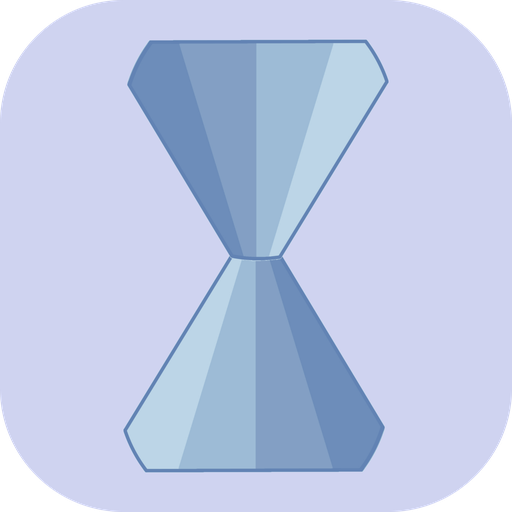

<div align="center">



# ⏱️ Desky — Yeolpumta Desktop Client

**A modern, powerful, and elegant desktop client for the Yeolpumta (YPT) study platform.**

[](https://flutter.dev)
[](https://github.com/huneyoliv/desky/releases)
[](LICENSE)
[](https://github.com/huneyoliv/desky/actions)
[](https://github.com/huneyoliv/desky)

**[English](README.md)** • **[Português (Brasil)](README.pt-BR.md)**

[Features](#-key-features) •
[Installation](#-installation--downloads) •
[Architecture](#-architecture--technologies) •
[Development](#-local-development) •
[Legal Disclaimer](#-legal-disclaimer) •
[License](#-license)

</div>

---

## 📖 About the Project

**Desky** was built to provide the ultimate desktop focus and productivity experience for students on Windows, macOS, and Linux. Featuring a dark theme inspired by Yeolpumta and optimized for high-resolution displays, it delivers all essential study capabilities natively on your PC.

---

## ✨ Key Features

### ⏱️ Study Timer & Pomodoro
- **Standard & Pomodoro Modes**: Customizable focus sessions, short breaks, and long breaks.
- **Subject Management**: Create, edit, archive, and customize subjects with color palettes.
- **Manual Study Logs**: Add past study sessions with instant time calculations.
- **Offline Synchronization**: Persistent request queue for uninterrupted tracking during connectivity drops.

### 🛡️ Focus Mode & Distraction Blocker
- **Process Monitoring**: Automated detection and alerts for unauthorized distraction applications open during study.
- **Strict Mode**: Locks navigation to maintain deep focus.
- **Floating Mini Player**: Compact timer overlay to monitor elapsed study time alongside study materials.

### 👥 Study Groups & Live Study
- **Real-Time Attendance Feed**: View active members studying live with real-time status updates.
- **Live Study**: Periodic webcam capture and secure upload for study verification.
- **Group Chat**: Rich messaging with emoji reactions, media attachments, and official YPT stickers.
- **Social Nudges**: Send "Shakes" to motivate group peers.

### 📅 Planner, Timetable & D-Days
- **D-Day Countdowns**: Visual countdown timers for exams, tests, and target milestones.
- **Smart To-Do List**: Priority-based tasks with due dates and recurrence rules.
- **Weekly Timetable**: Interactive weekly schedule grid organized by subject blocks.

### 📊 Global Rankings & Activity Heatmap
- **Multilevel Leaderboards**: Real-time global, national, and category-based leaderboards.
- **Activity Heatmap Grid**: GitHub-style annual matrix visualizing daily study intensity and consistency.
- **Monthly Calendar**: Detailed day-by-day study streaks and goal completion.

### 🃏 Flashcards & PDF Reader
- **Custom Decks**: Organize study cards by subject and topic with SM-2 spaced repetition algorithm.
- **Integrated PDF Reader**: Open books and materials with page bookmarking and quick flashcard creation.

### 📹 Timelapse Recorder
- Automated study session screen captures with built-in gallery viewer and video playback.

### 🎨 Avatars & Store
- Customizable doll avatars with outfits, accessories, and dynamic poses reactive to study state.

### 🌐 Comprehensive Internationalization (i18n)
- Native support for 28 languages with instant runtime locale switching.

### 🔄 In-App Update Notifications
- Automatic release checks against GitHub Releases API with animated badge indicator in sidebar.
- Modal dialog with full changelog release notes and direct native installer download buttons.

---

## 💻 Installation & Downloads

Download the latest version directly from our official [**Releases Page**](https://github.com/huneyoliv/desky/releases/latest).

| Platform | Package / Installer | Format | Installation Instructions |
| :--- | :--- | :--- | :--- |
| **Windows** | `Desky-Windows-Installer-x64.exe` | Executable Setup | Run the `.exe` installer and follow the setup wizard. |
| **macOS** | `Desky-macOS-Installer.dmg` | Disk Image | Open `.dmg` and drag `Desky.app` to your `Applications` folder. |
| **Linux (Debian/Ubuntu)** | `Desky-Linux-x64.deb` | Debian Package | Run `sudo apt install ./Desky-Linux-x64.deb` or `sudo dpkg -i Desky-Linux-x64.deb`. |
| **Linux (Other Distros)** | `Desky-Linux-x64.tar.gz` | Portable Archive | Extract the archive and execute `./desky`. |

---

## 🏗️ Architecture & Technologies

The codebase follows **Clean Architecture** principles with clear layer separation:

```
lib/
├── core/                  # Core services, networking, themes, constants & i18n
│   ├── api/               # HTTP client (Dio) and auth interceptors
│   ├── cdn/               # Dynamic CDN resolvers for avatars & assets
│   ├── constants/         # API endpoints and application defaults
│   ├── localization/      # Translation engine and fallback dictionaries
│   ├── services/          # System services (Focus, Webcam, Updates, Window)
│   └── theme/             # Dark theme palette, typography & styles
├── data/                  # Data layer, DTOs and repositories
│   ├── models/            # Data models with JSON serialization
│   └── repositories/      # API communication and data access abstraction
├── features/              # Feature-first modular components
│   ├── auth/              # Email authentication & social logins (Google / Apple)
│   ├── challenges/        # Study challenges and goals
│   ├── flashcards/        # Deck management & SM-2 algorithm
│   ├── focus/             # Process blocker and Mini Player
│   ├── groups/            # Study groups, attendance, chat & Live Study
│   ├── notifications/     # Notification center and alerts
│   ├── planner/           # Planner, To-Do list & timetable grid
│   ├── profile/           # User profile and account security
│   ├── ranks/             # Leaderboards, Heatmap matrix & calendar
│   ├── settings/          # Study preferences, language and legal dialogs
│   ├── smartbook/         # Built-in PDF reader and study material viewer
│   ├── store/             # Avatar inventory & store
│   ├── timelapse/         # Screen recording & timelapse playback
│   ├── timer/             # Main study timer, Pomodoro & subject tracker
│   └── updates/           # Release checker, changelog viewer & installer links
└── shared/                # Shared widgets (AppShell, SidebarNav, TitleBar, Avatars)
```

### Key Libraries:
- **Framework**: [Flutter Desktop](https://flutter.dev) (Dart 3.x)
- **State Management**: [Flutter Riverpod](https://riverpod.dev)
- **Routing**: [GoRouter](https://pub.dev/packages/go_router)
- **Networking**: [Dio](https://pub.dev/packages/dio)
- **Secure Storage**: [flutter_secure_storage](https://pub.dev/packages/flutter_secure_storage) & [shared_preferences](https://pub.dev/packages/shared_preferences)
- **Charts & Animations**: [FL Chart](https://pub.dev/packages/fl_chart) & [Lottie](https://pub.dev/packages/lottie)
- **Desktop Window Control**: [window_manager](https://pub.dev/packages/window_manager)

---

## 🛠️ Local Development

### Prerequisites
- [Flutter SDK](https://flutter.dev/docs/get-started/install) (`>= 3.0.0`)
- **Windows**: Visual Studio 2022 with "Desktop development with C++" workload.
- **macOS**: Xcode 15+ with command line tools.
- **Linux**: Build dependencies:
  ```bash
  sudo apt-get install clang cmake ninja-build pkg-config libgtk-3-dev liblzma-dev libsecret-1-dev libjsoncpp-dev
  ```

### Cloning the Repository
```bash
git clone https://github.com/huneyoliv/desky.git
cd desky
```

### Installing Dependencies
```bash
flutter pub get
```

### Running the App
```bash
# Windows
flutter run -d windows

# macOS
flutter run -d macos

# Linux
flutter run -d linux
```

### Running the Test Suite
```bash
# Run all automated tests
flutter test

# Static code analysis
flutter analyze
```

---

## ⚖️ Legal Disclaimer

**Desky** is an independent, open-source third-party client and is not affiliated, endorsed, sponsored, or associated with **Pallo Inc.** or **Yeolpumta (YPT)**. All trademarks belong to their respective owners.

---

## 📄 License

This project is licensed under the [MIT](LICENSE) License.
